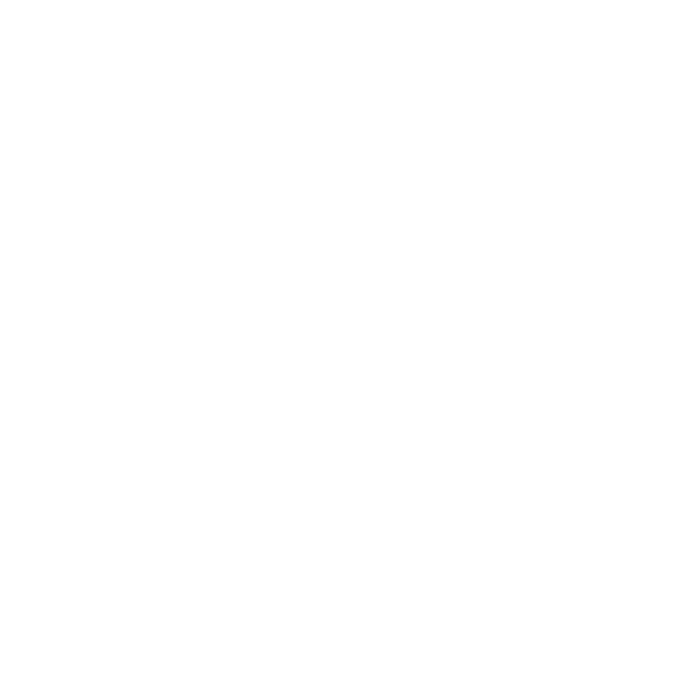

# GeoLink_Logistics


this article introduces our user-friendly web application that aims to improve logistics management and supply chaines using a geolocation solution Our focus is making our users to have a better experience in managing their work with a simple interface , making it easier to interact for both clients and drivers and make it possible for them to have a bette communication and tracking system.
In our application, we have integrated a map that allow users to track their orders and drivers in real time, and also to have a better visibility on the delivery process.

## Table of Contents
- [Overview](#overview)
- [Software architecture](#Software_Architecture)
- [Frontend](#frontend)
- [Backend](#backend)
- [Getting Started](#getting-started)
- [Dependencies](#dependencies)
- [Video Demonstration](#Video-Demonstration)
GeoLink_Logistics


## overview

Our application is a web-based platform that aims to improve logistics management and supply chaines using a geolocation solution. The application is designed to be user-friendly and easy to use, with a simple interface that makes it easier for both clients and drivers to interact. The main features of the application include a map that allows users to track their orders and drivers in real time, as well as a communication and tracking system that provides better visibility on the delivery process. The application is designed to be scalable and flexible, with the ability to integrate with other systems and services as needed.

## Software Architecture
.png)

The GeoLink project is a logistics and supply chain improvement solution built using the MERN stack (MongoDB, Express, React, Node.js). MongoDB stores user data and shipment information, while Firebase handles storage for photos of both products and users. The frontend is developed with React and Mapbox for geolocation and mapping functionalities. The backend uses Node.js with Express, structuring the application with controllers in controllers directory, models in models directory, and routes in routes directory to handle authentication, shipment tracking, and data management. The frontend interacts with the backend through API endpoints defined in these routes to perform necessary operations, ensuring an efficient and responsive user experience.


## Backend

### Technologies Used

- Mangodb
- Node.js
- Firebase
- Express.js

## Backend Project Structure

The backend code follows a modular and organized structure, leveraging the power of React.js for building a robust and scalable application.

### 1. `GeoLink_Logistics.application`

- **Main GeoLink_Logistics Class:** `GeoLink_Logistics` serves as the entry point for the React.js application. It includes the `main` method to start the application.

### 2. `tryCatch.js.controller`

- **tryCatch.js:** This utility function wraps controller functions, handling any errors that occur during their execution by logging the error and sending an appropriate error response with a status code of 500, providing a layer of error handling abstraction for HTTP request processing.
  
### 3. `GeoLink_Logistics.service`

- **checkOwner.js:** This service function checks if the authenticated user is the owner of a specific offer by querying the database with the offer ID and the user ID, returning true if the user is the owner, false otherwise, or 'error' in case of an error.

- **offerPermissions.js:** This service module defines permissions for updating and deleting offers based on user roles and ownership, utilizing the checkOwner service function to determine ownership status, and provides a layer of abstraction between controllers and repositories by encapsulating business logic related to offer permissions.

- **userPermissions.js:** This service module defines permissions for listing users and updating user status based on user roles, adhering to the structure where roles determine access levels within the application. It encapsulates business logic and serves as an intermediary between controllers and repositories, providing a clean abstraction layer for managing user-related operations.


### 4. `GeoLink_Logistics.model`

- **Offer.js:**  This model defines the structure and constraints for offers in the application, including geographical location, price, title, description, images, and user information, and maps to the MongoDB collection with timestamps.

- **User.js:** This model defines the structure and constraints for user accounts in the application, including name, email, password, photo URL, role, and active status, and maps to the MongoDB collection with timestamps.
  
### 5. `GeoLink_Logistics.repository`

- **Repository Interfaces:** The repository package houses interfaces that facilitate database interactions using MongoDB and Mongoose, providing methods for fundamental CRUD operations for the Breadcrumbs GeoLink_Logistics application.


### Dependencies

  
1. **Supercluster:**
   - Purpose: A JavaScript library for fast geospatial indexing and clustering of spatial data.
   - Description: Supercluster offers efficient algorithms for clustering large sets of spatial data, enhancing performance and scalability in mapping applications.


2. **Node.js:**
   - Purpose: A JavaScript runtime built on Chrome's V8 JavaScript engine for server-side applications.
   - Description: Node.js allows the execution of JavaScript code outside a web browser, enabling the development of scalable and high-performance server-side applications.

3. **Express.js:**
   - Purpose: A minimalist web application framework for Node.js.
   - Description: Express.js simplifies the process of building web applications and APIs with Node.js by providing a robust set of features for routing, middleware, and HTTP request handling.

4. **MongoDB:**
   - Purpose: A NoSQL document database for storing and retrieving data in JSON-like documents.
   - Description: MongoDB offers flexibility and scalability for managing structured and unstructured data, making it suitable for a wide range of use cases, including real-time analytics, content management, and mobile applications.

5. **Mongoose:**
   - Purpose: An Object Data Modeling (ODM) library for MongoDB and Node.js.
   - Description: Mongoose simplifies interactions with MongoDB databases by providing a schema-based solution for modeling application data, enforcing data validation, and defining query interfaces.

 6.**Firebase Storage:**
   - Purpose: A cloud storage solution provided by Google Firebase for storing user-generated content.
   - Description: Firebase Storage offers scalable and secure file storage for web and mobile applications, allowing developers to upload and download files easily while leveraging Firebase's authentication and security features.

 7.**Mapbox:**
   - Purpose: A mapping platform for building custom maps and location-based applications.
   - Description: Mapbox provides APIs and SDKs for integrating interactive maps, geocoding, and navigation features into web and mobile applications, offering customization options and real-time data visualization capabilities.

9. **React-Map-GL:**
   - Purpose: A React component library for creating interactive maps using Mapbox GL JS.
   - Description: React-Map-GL simplifies the integration of Mapbox GL JS functionality into React applications, enabling developers to build dynamic and responsive mapping experiences with React components.

11. **Global Context Provider:**
    - Purpose: A pattern or mechanism for managing global state and sharing data across components in a React application.
    - Description: The Global Context Provider pattern allows centralized management of application state, reducing prop drilling and providing a convenient way to share data and functionality across components without the need for prop passing at every level.


  


## Getting Started

Certainly! Here are step-by-step instructions to set up and run your project locally:

### Prerequisites:

1. **Git:**
   - Make sure you have Git installed. If not, download and install it from [git-scm.com](https://git-scm.com/).

2. **MongoDb:**
   - Install MongoDb from ([https://www.mongoDb.org/](https://www.mongodb.com/try/download/community)).
   - Connect to the server created .
   - Ensure MongoDb is using port 5000.

3. **Node JS:**
   - Install NPM from [nodejs.com/npm](https://nodejs.org/en/download/package-manager).

### Backend Setup:

1. **Clone the Project:**
   ```bash
   git clone <repository_url>
   cd <project_folder>
   ```

2. **Install Backend Dependencies:**
   - Open a terminal in the backend project folder.
   - Run the following commands:
     ```bash
     npm install jwt-decode
     npm install jsonwebtoken
     npm install express dotenv google-auth-library
     npm install bcryptjs
     npm install uuid
     npm install firebase
     ```

3. **Run Backend:**
   - Start your Mongodb server.
   - Run the application. The database and entities will be created automatically.
   - When it works it gonna show listening on port 5000.

### Frontend Setup:

1. **Install Node.js and React:**
   - Open a new terminal for the frontend project.
   - Ensure Npm is installed.
   - Install React CLI globally: `npm install -g create-react-app`.

2. **Install Frontend Dependencies:**
   - Run the following commands in the frontend project folder:
     ```bash
     npm install
     ```

   - If you encounter errors during installation, use the following command:
     ```bash
     npm install --save --legacy-peer-deps
     ```

3. **Run Frontend:**
   - After installing dependencies, start the React development server:
     ```bash
     npm start
     ```

   - Access the frontend at [http://localhost:3000/](http://localhost:3000/) in your browser.

Now, your full-stack project should be up and running locally. If you encounter any issues during setup, check the console logs for error messages and ensure that all dependencies and prerequisites are correctly installed.


