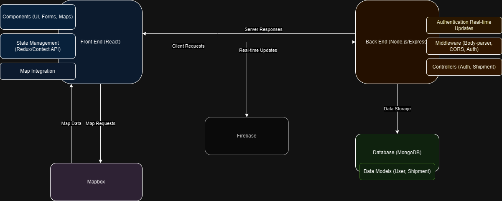

# GeoLink_Logistics

this article introduces our user-friendly web application that aims to improve logistics management and supply chaines using a geolocation solution Our focus is making our users to have a better experience in managing their work with a simple interface , making it easier to interact for both clients and drivers and make it possible for them to have a bette communication and tracking system.
In our application, we have integrated a map that allow users to track their orders and drivers in real time, and also to have a better visibility on the delivery process.

## Table of Contents
- [Overview](#overview)
- [Software architecture](#Software_Architecture)
- [Frontend](#frontend)
- [Backend](#backend)
- [Getting Started](#getting-started)
- [Dependencies](#dependencies)
- [Video Demonstration](#Video-Demonstration)
GeoLink_Logistics

## overview

Our application is a web-based platform that aims to improve logistics management and supply chaines using a geolocation solution. The application is designed to be user-friendly and easy to use, with a simple interface that makes it easier for both clients and drivers to interact. The main features of the application include a map that allows users to track their orders and drivers in real time, as well as a communication and tracking system that provides better visibility on the delivery process. The application is designed to be scalable and flexible, with the ability to integrate with other systems and services as needed.

## Software Architecture

The GeoLink project is a logistics and supply chain improvement solution built using the MERN stack (MongoDB, Express, React, Node.js). MongoDB stores user data and shipment information, while Firebase handles storage for photos of both products and users. The frontend is developed with React and Mapbox for geolocation and mapping functionalities. The backend uses Node.js with Express, structuring the application with controllers in controllers directory, models in models directory, and routes in routes directory to handle authentication, shipment tracking, and data management. The frontend interacts with the backend through API endpoints defined in these routes to perform necessary operations, ensuring an efficient and responsive user experience.
